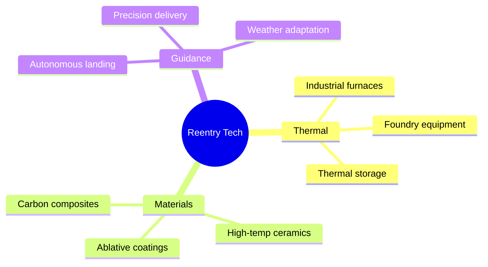

# QA and User Testing Report

**Date:** February 8, 2026
**Session Type:** Live User Testing Session
**Duration:** ~60 minutes
**Facilitator:** Yehonathan Sagir

---

## Executive Summary

A live user testing session was conducted with PWS methodology experts and product stakeholders to evaluate Mindrian's ability to support open-ended exploration of novel application domains. The test case involved finding innovative applications for atmospheric reentry vehicle technology.

**Overall Assessment:** Mindrian successfully demonstrated core AI consultation capabilities but revealed critical UX gaps around conversation management, context persistence, and idea visualization that prevent effective exploration sessions.

---

## Participants

| Name | Role | Focus Area |
|------|------|------------|
| Lawrence Aronhime | PWS Methodology Expert | Innovation frameworks, Socratic coaching |
| Adam Peters | Product Stakeholder | User experience, practical applicability |
| Austin Granmoe | Technical Advisor | Feasibility assessment |
| Jonathan Edwards | User Tester | First-time user perspective |
| Yehonathan Sagir | Facilitator/Developer | System behavior, debugging |

---

## Test Scenario

**Objective:** Use Mindrian to explore novel commercial applications for atmospheric reentry vehicle technology (heat shields, guidance systems, materials science).

**Methodology:** Open-ended PWS exploration using the Larry/Lawrence agents to brainstorm, research, and map potential application domains.

**Success Criteria:**
- Generate at least 5 distinct application domains
- Avoid premature convergence on obvious solutions
- Maintain exploration context across conversation turns
- Allow user to manage/organize discovered ideas

---

## Findings

### Critical Issues (P0)

| ID | Issue | Impact | User Quote/Evidence |
|----|-------|--------|---------------------|
| BUG-001 | **Context persistence failure** - System repeatedly returned to "in-space manufacturing" topic despite user explicitly saying to avoid it | Derailed exploration, frustrated user | "We keep coming back to in-space manufacturing even though I said I don't want to go there" |
| BUG-002 | **No conversation save/persist** - Users cannot save exploration sessions for later continuation | Lost work, prevents long-term research | "If I close this, I lose everything we talked about" |
| BUG-003 | **No topic blacklist** - Cannot tell system to permanently avoid certain topics | Wasted turns, user frustration | "I wish I could just tell it to never mention X again" |

### High Priority Issues (P1)

| ID | Issue | Impact | Recommendation |
|----|-------|--------|----------------|
| UX-001 | **No conversation branching/forking** - Linear chat prevents parallel exploration paths | Limits exploration patterns | Implement conversation tree UI |
| UX-002 | **No idea visualization/mind-map** - Explored concepts exist only as chat text | Hard to see big picture | Add real-time idea mapping component |
| UX-003 | **No project-based organization** - Everything is a single linear conversation | Can't organize related explorations | Implement project/folder structure |
| UX-004 | **Research results not persistent** - Tavily search results disappear after response | Have to re-search same topics | Store research in session context |

### Medium Priority Issues (P2)

| ID | Issue | Impact | Recommendation |
|----|-------|--------|----------------|
| UX-005 | No export of exploration to structured format (JSON/Notion/etc.) | Manual copy-paste required | Add "Export Ideas" action |
| UX-006 | Multi-Agent panel doesn't show which agents contributed what | Unclear source of insights | Add agent attribution badges |
| UX-007 | No way to mark certain ideas as "interesting" or "discard" | All ideas equal weight | Add idea tagging/rating |

### Positive Observations

| Finding | Details |
|---------|---------|
| PWS questioning effective | Larry's Socratic approach helped uncover assumptions user hadn't considered |
| Research integration works | Tavily searches provided relevant current information on reentry tech applications |
| Multi-agent potential clear | Users wanted MORE multi-agent discussion, not less |
| Domain pivots helpful | System successfully pivoted between aerospace, materials, and thermal domains |

---

## Detailed Issue Analysis

### BUG-001: Context Persistence Failure

**Description:** During the exploration session, the user explicitly stated they wanted to avoid "in-space manufacturing" as an application domain. However, the system repeatedly returned to this topic in subsequent responses.

**Root Cause Hypothesis:**
1. RAG retrieval pulls in-space manufacturing from knowledge base regardless of user preference
2. Conversation history doesn't include negative preferences ("don't mention X")
3. System prompt doesn't have instruction to track excluded topics

**Recommended Fix:**
```python
# Add to user session state
excluded_topics = cl.user_session.get("excluded_topics", [])

# In system prompt augmentation
if excluded_topics:
    exclusion_note = f"\n\nIMPORTANT: The user has asked to AVOID these topics: {', '.join(excluded_topics)}. Do not suggest or return to these areas."
    system_prompt += exclusion_note
```

**Test Case:**
1. Start exploration session
2. System suggests topic X
3. User says "Let's not go down the X path"
4. Verify X doesn't appear in next 5 responses
5. Verify X doesn't appear even when RAG would normally retrieve it

---

### UX-001: Conversation Branching/Forking

**Description:** Users wanted to explore multiple paths simultaneously (e.g., "What if we went thermal vs. materials vs. guidance systems?") but linear chat forces sequential exploration.

**User Mental Model:**
```
                    ┌─> Thermal Applications
                    │
Reentry Tech ──────>├─> Materials Science
                    │
                    └─> Guidance/Control Systems
```

**Current UI:** Single linear thread, must fully explore one path before another.

**Recommended Solution:**
1. Add "Fork Conversation" action button
2. Creates new conversation tab/branch from current point
3. Visual tree view shows all branches
4. Can merge insights from branches back together

**Design Mockup:**
```
[Main Chat]                    [Branch Selector]
┌────────────────────┐         ┌─────────────────────┐
│ Exploring reentry  │         │ ○ Main (12 msgs)    │
│ applications...    │         │ ├─● Thermal (5 msgs)│
│                    │         │ ├── Materials (3)   │
│ [Fork Here 🍴]     │         │ └── Guidance (0)    │
└────────────────────┘         └─────────────────────┘
```

---

### UX-002: Idea Visualization/Mind-Map

**Description:** As exploration progressed, users lost track of the "idea space" they had covered. Everything existed only as chat messages.

**User Need:** Real-time visual representation of explored concepts and their relationships.

**Recommended Solution:** Integrate the existing `MermaidDiagram.jsx` component for real-time idea mapping.

**Implementation Approach:**
1. After each substantive exchange, LLM extracts key concepts
2. Concepts added to session-persistent idea graph
3. Graph rendered as side panel or floating element
4. Clicking node jumps to relevant conversation turn

**Example Auto-Generated Map:**


---

## Feature Requests Captured

| Priority | Request | User | Implementation Effort |
|----------|---------|------|----------------------|
| P0 | Conversation persistence/save | All | Medium (DB schema change) |
| P0 | Topic blacklist | Lawrence | Low (session state + prompt) |
| P1 | Conversation forking | Adam | High (new UI paradigm) |
| P1 | Idea mind-map | Austin | Medium (use existing component) |
| P2 | Project organization | Jonathan | High (new data model) |
| P2 | Export to Notion/Miro | Adam | Medium (API integrations) |

---

## Recommended Action Plan

### Immediate (This Week)

1. **Fix context persistence** - Add excluded_topics to session state
2. **Enable conversation save** - Ensure PostgreSQL persistence is working (related to ongoing DB issues)
3. **Add "Save Session" button** - Explicit user action to persist

### Short-Term (2 Weeks)

4. **Implement topic blacklist** - UI to manage excluded topics
5. **Auto-generate idea map** - Integrate MermaidDiagram for exploration visualization
6. **Add idea tagging** - Like/discard/star ideas for later reference

### Medium-Term (1 Month)

7. **Conversation forking** - Design and implement branch UI
8. **Project organization** - Group related conversations
9. **Export integrations** - Notion, Miro, Markdown export

---

## Test Coverage Gaps Identified

| Area | Missing Test | Priority |
|------|--------------|----------|
| Context persistence | Test that excluded topics stay excluded across 10+ turns | P0 |
| Session save/load | Test that resumed session has full context | P0 |
| Multi-agent attribution | Test that agent sources are visible in responses | P1 |
| Idea extraction | Test that key concepts are extracted from conversation | P1 |

---

## Session Recording

**Transcript available:** Contact Yehonathan Sagir for full transcript
**Key timestamps:**
- 0:05 - Session introduction and test scenario setup
- 0:12 - First exploration of reentry applications
- 0:25 - User attempts to avoid in-space manufacturing (context persistence issue begins)
- 0:35 - Discussion of need for conversation branching
- 0:45 - Frustration with linear exploration expressed
- 0:55 - Summary and feature request collection

---

## Next Steps

1. [ ] Schedule follow-up session after P0 fixes implemented
2. [ ] Create GitHub issues for each finding
3. [ ] Add automated tests for context persistence
4. [ ] Design mockups for conversation branching UI
5. [ ] Prototype idea map integration

---

## Appendix A: Raw Issue List

```
BUGS:
- BUG-001: Context persistence failure (P0)
- BUG-002: No conversation save (P0)
- BUG-003: No topic blacklist (P0)

UX ISSUES:
- UX-001: No conversation branching (P1)
- UX-002: No idea visualization (P1)
- UX-003: No project organization (P1)
- UX-004: Research not persistent (P1)
- UX-005: No export capability (P2)
- UX-006: No agent attribution (P2)
- UX-007: No idea rating (P2)

FEATURE REQUESTS:
- FR-001: Conversation forking
- FR-002: Real-time mind-map
- FR-003: Project folders
- FR-004: Notion/Miro export
- FR-005: Topic blacklist management UI
```

---

## Appendix B: Stakeholder Quotes

> "This is powerful for getting started, but I need a way to capture what we're discovering." - Adam Peters

> "The Socratic approach is exactly right. Now we need the tools to manage the exploration." - Lawrence Aronhime

> "I keep losing my train of thought because everything is linear." - Jonathan Edwards

> "If I could fork the conversation when we hit a decision point, that would change everything." - Austin Granmoe

---

*Report generated: February 8, 2026*
*Prepared by: QA Automation + Claude Code*
